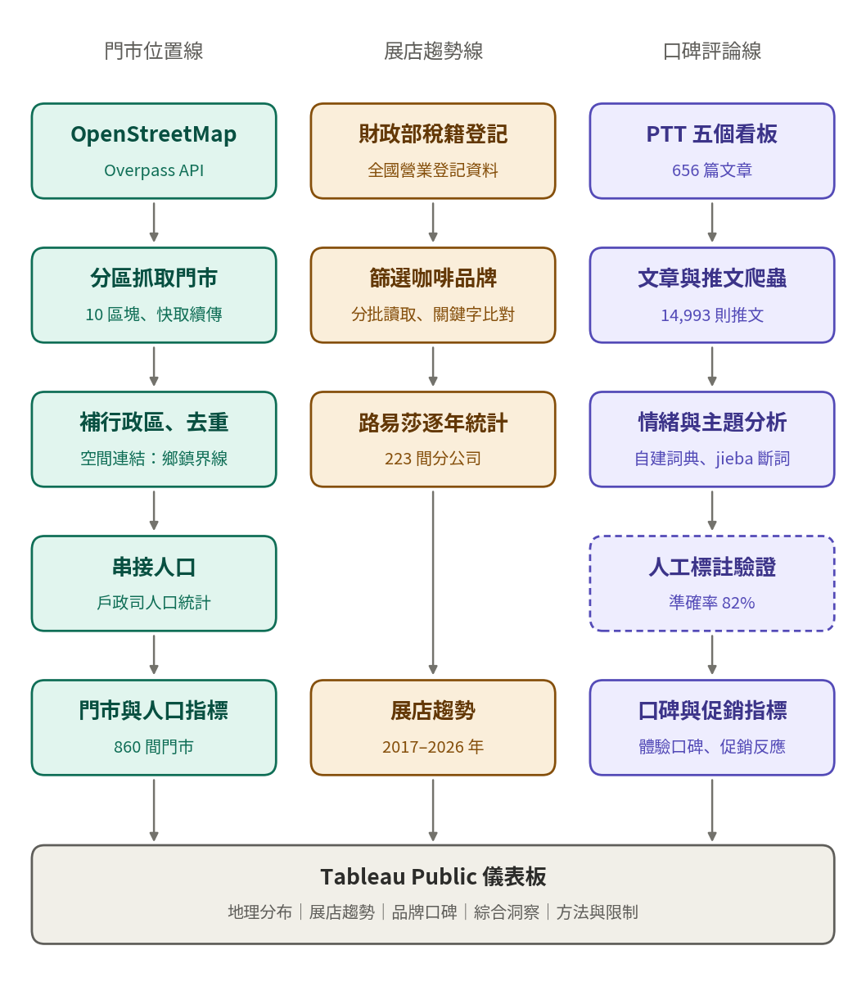

# 台灣連鎖咖啡品牌：展店策略與網路口碑分析

以免費公開資料，比較星巴克、路易莎、Cama、怡客、丹堤五個連鎖咖啡品牌的門市分布、展店趨勢與 PTT 網路口碑，並以 Tableau Public 呈現互動式儀表板。

**互動儀表板**：https://public.tableau.com/app/profile/shihyuan.hsu/viz/_17911135071140/1

## 分析問題

台灣連鎖咖啡品牌的展店策略與消費者口碑，有什麼落差？

1. 各品牌的門市分布在哪裡？跟人口分布是否一致？
2. 路易莎的展店節奏與區域重心如何變化？
3. 消費者在網路上如何評價各品牌？討論集中在哪些主題？
4. 門市規模、口碑與促銷反應三者之間是什麼關係？

## 主要發現

**連鎖咖啡跟著「白天的人」走，而不是住的人。** 每萬人門市數最高的鄉鎮多為商辦區與交通樞紐，例如臺北市中正區（2.36）、大安區（1.84）、中山區（1.74）。星巴克有 41% 的門市在中南部，路易莎只有 29%。

**路易莎走過擴張、放緩、再加速三階段，新店重心往中南部移。** 2018 至 2021 年快速擴張，2022、2023 年每年僅新設 7、8 間，2025 年新設 42 間為歷年最高。新店開在北部的比例，從 2020–2022 年的 90% 降到 2023 年後的 61%。

**Cama 口碑最正面、星巴克中性、路易莎偏負面。** 體驗口碑淨情緒指數分別為 +27、+5、-42。路易莎在「爭議與抵制」主題達 -92，但排除爭議留言後仍為 -29，負面口碑不只來自單一事件。

**促銷反應與品牌定位有關。** 路易莎優惠文的噓比例為 17.8%，約為星巴克（9.6%）的兩倍，其他品牌介於 5% 到 7%。

## 系統架構



## 資料來源

| 資料 | 來源 | 用途 |
|---|---|---|
| 門市位置 | OpenStreetMap（Overpass API），2026 年 9 月擷取 | 門市分布、品牌比較 |
| 營業登記 | 財政部全國營業（稅籍）登記資料集 | 路易莎展店趨勢 |
| 行政區界線 | 內政部鄉鎮市區界線（TWD97 經緯度） | 依座標判斷門市所在鄉鎮 |
| 人口 | 內政部戶政司各鄉鎮市區人口密度 | 計算每萬人門市數 |
| 網路口碑 | PTT：Coffee、Food、CVS、Lifeismoney、Gossiping 看板 | 情緒與主題分析 |

## 專案結構

| 檔案 | 說明 |
|---|---|
| `process_tax_registration.py` | 從稅籍資料篩出咖啡品牌（分批讀取大檔、民國轉西元） |
| `fetch_osm_coffee.py` | 從 OSM 分區抓取門市，含重試、換伺服器與斷點續傳 |
| `clean_stores.py` | 以空間連結補上縣市與鄉鎮，並移除 30 公尺內的重複點位 |
| `add_population.py` | 串接人口資料，計算每萬人門市數 |
| `louisa_trend.py` | 整理路易莎分公司的設立年份與區域分布 |
| `ptt_scraper.py` | 抓取 PTT 文章與推文，含斷點續傳 |
| `lexicon.py` | 自建咖啡情境情緒詞典與主題詞典 |
| `sentiment_analysis.py` | 留言情緒判斷、主題統計、人工標註驗證 |
| `build_overview.py` | 合併各項指標為品牌總表 |
| `*.csv` | 各步驟產出的彙總資料，即儀表板使用的資料 |

## 如何重現

環境：Python 3.11 以上。

```bash
python -m venv .venv
.venv\Scripts\activate        # macOS / Linux：source .venv/bin/activate
pip install -r requirements.txt
```

需要手動下載的原始資料：

1. 財政部「全國營業（稅籍）登記資料集」，檔名 `BGMOPEN1.zip`，放在專案根目錄
2. 內政部「鄉鎮市區界線（TWD97 經緯度）」，解壓縮到 `town_boundary/`
3. 內政部戶政司「各鄉鎮市區人口密度」，改名為 `population.csv`

依序執行：

```bash
python process_tax_registration.py
python fetch_osm_coffee.py
python clean_stores.py
python add_population.py
python louisa_trend.py
python ptt_scraper.py
python sentiment_analysis.py
python build_overview.py
```

## 方法與驗證

- **情緒判斷**：以自建詞典比對留言，長詞優先比對，並處理否定詞（例如「不會很貴」判為正面）。隨機抽樣 100 則留言人工標註，詞典整體準確率 82%，主要誤差為低估負面情緒（部分來自反諷用語）。
- **不以推噓作為口碑指標**：驗證時發現許多標為「推」的留言內容是負面的，因為推噓代表的是「是否同意發文者」，而非對品牌的態度。
- **文章分類**：優惠情報文歸為「促銷反應」，其他文章歸為「體驗口碑」，分開計算。
- **交叉檢查**：分析範圍總人口 2,263 萬，與扣除花東、金馬後的官方人口相符。
- **敏感度檢驗**：排除爭議留言或負面留言最多的 3 篇文章後，路易莎淨情緒仍為 -29 至 -35。

## 限制

- OSM 由志工編輯，各地區與品牌的收錄完整度不一，門市數可能低於實際。
- 稅籍資料僅含營業中門市，已關閉門市無法納入，早期年份可能低估；路易莎分公司最早只到 2017 年，早期門市可能於當年重新登記。
- 以戶籍人口計算密度，商辦區會被高估。
- PTT 標題搜尋只能找到標題提到品牌的文章；路易莎的討論多出現在新聞與八卦板，可能使其口碑偏負面。
- 丹堤、怡客的口碑樣本不足，未納入品牌口碑比較。分析範圍不含花東與離島。

## 資料倫理與授權

- 本專案僅公開彙總後的統計數字，不包含 PTT 使用者帳號與留言原文；爬蟲每次請求間隔 1 秒，避免對伺服器造成負擔。
- 門市位置資料 © OpenStreetMap contributors，依 ODbL 授權使用。
- 政府資料依「政府資料開放授權條款」使用。

## 使用工具

Python（pandas、geopandas、requests、beautifulsoup4、jieba）、Tableau Public
